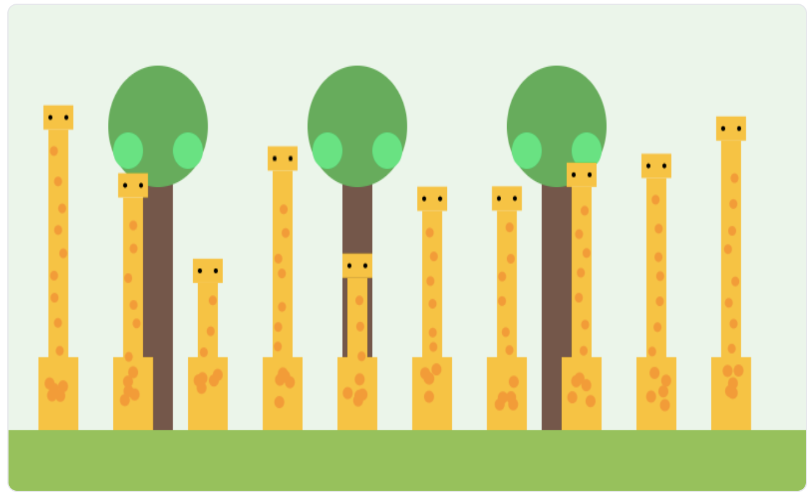

# Natural Selection Simulation



Try it out here: [Live Demo](https://stile-evolution-giraffe-sim.vercel.app/)

## Overview

This interactive web application demonstrates the principles of natural selection through a giraffe evolution simulation. Users can observe how giraffes with different neck heights compete for food resources, and how this selection pressure drives evolutionary change over multiple generations.

## Key Concepts Demonstrated

- **Natural Selection**: The process by which organisms better adapted to their environment tend to survive and produce more offspring.
- **Random Variation**: Genetic differences that naturally occur between individuals in a population.
- **Adaptation**: Traits that help organisms survive in their specific environment.
- **Selection Pressure**: Environmental factors (like food availability) that influence which traits are advantageous.

## Features

- Interactive canvas-based simulation
- Adjustable tree height to modify selection pressure
- Real-time statistics tracking (generation count, survival rate, average neck height)
- Play/pause and reset controls

## Technical Implementation

After a brainstrom session gathering assets and dissecting the problem, I came up with a few concept that could represent the idea.


the technology choice made for this demo (Next.js, Vercel, tailwind styling) are not the most suited for the final production version but were used it for rapid prototyping.

## Getting Started

### Prerequisites

- Node.js 18.18.0 or higher
- pnpm, npm, or yarn

### Installation

1. Clone the repository:

   ```
   git clone https://github.com/yourusername/natural-selection-simulation.git
   cd natural-selection-simulation
   ```

2. Install dependencies:

   ```
   pnpm install
   ```

3. Run the development server:

   ```
   pnpm dev
   ```

4. Open [http://localhost:3000](http://localhost:3000) in your browser.

## How the Simulation Works

1. A population of giraffes with random neck heights is generated
2. Trees with leaves at a specific height provide the food source
3. Only giraffes with necks long enough to reach the leaves survive
4. Surviving giraffes form the next generation
5. Tree height increases slightly each generation, creating ongoing selection pressure
6. Over time, the average neck height of the population increases through natural selection

## Educational Context

This simulation is designed as part of a lesson on evolution and natural selection. It provides a visual and interactive way to understand how environmental pressures can drive evolutionary change over generations.

## Acknowledgments

Inspired by educational content from Stile Education
